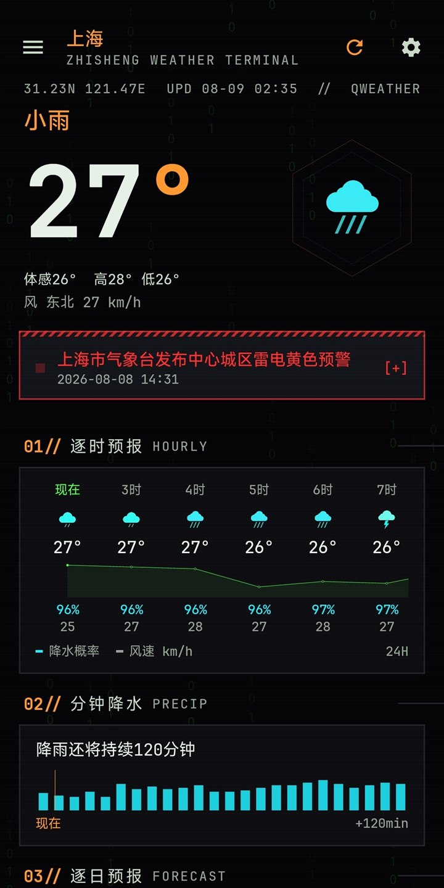
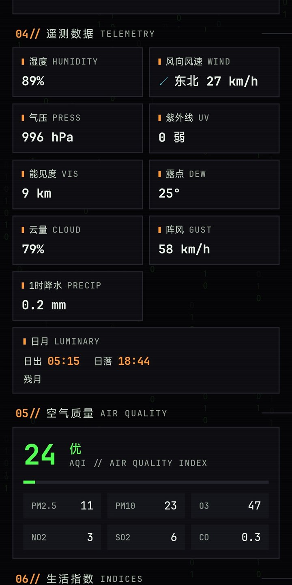
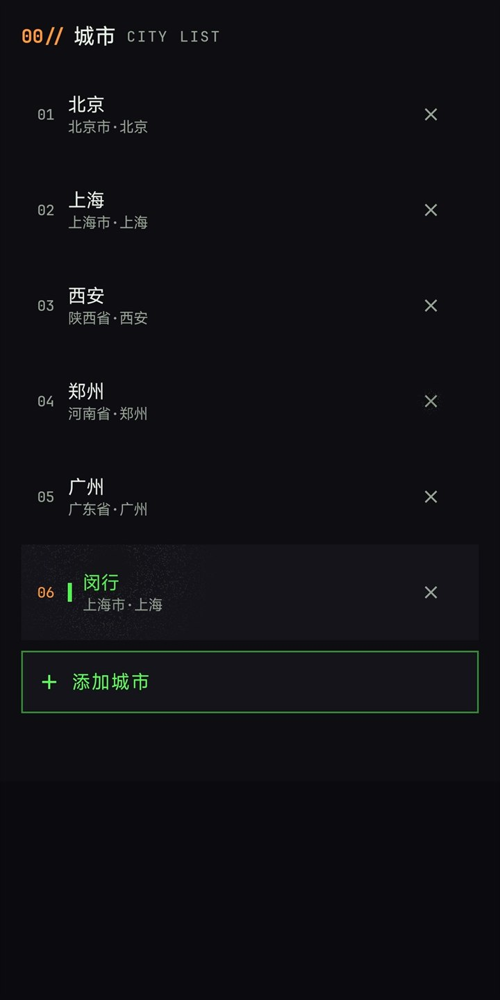
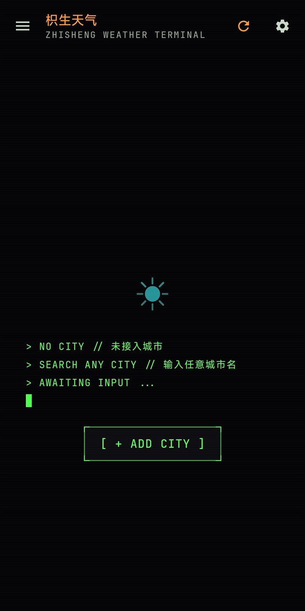
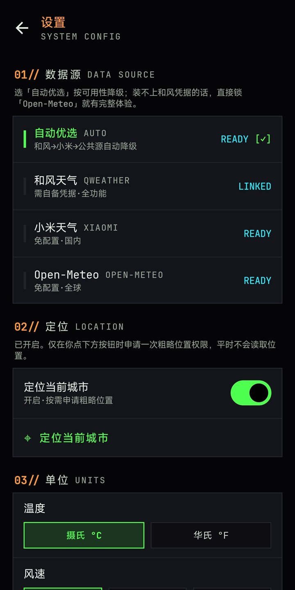

# Zhisheng Weather

An Android weather app with a dark terminal-style interface. It has no ads or account system, and the public APK works without API credentials.

[Download the latest APK](https://github.com/ZhishengZZ/ZhishengWeather/releases/latest) · [简体中文](README.md)

Current version: `0.0.2` · Android 8.0+ · [MIT License](LICENSE)

## Screenshots

<table>
  <tr>
    <th width="50%">Home</th>
    <th width="50%">Detailed conditions</th>
  </tr>
  <tr>
    <td></td>
    <td></td>
  </tr>
</table>

<table>
  <tr>
    <th width="33%">Saved cities</th>
    <th width="33%">Add a city</th>
    <th width="33%">Settings</th>
  </tr>
  <tr>
    <td></td>
    <td></td>
    <td></td>
  </tr>
</table>

These screenshots come from a v0.0.2 development build with QWeather credentials configured. The public APK does not include those credentials; Xiaomi Weather and Open-Meteo work without setup.

## What it does

- Current conditions, weather alerts, a 24-hour forecast, and a 15-day outlook
- Two-hour precipitation, air quality, sunrise and sunset, moon phase, and life indices
- Multiple saved cities with quick switching; Beijing is added on first install
- Home-screen widgets in 2x2, 4x2, and 4x4 sizes
- Temperature, wind, and pressure units, plus per-section display toggles
- Optional rain, snow, fog, and thunderstorm background effects

Coverage differs by provider. Open-Meteo, for example, does not supply Chinese official alerts or life indices. Optional data from Xiaomi Weather, including typhoon and yesterday summaries, can also be empty. Missing data is left missing rather than replaced with guessed values.

## Install

1. Open the [latest release](https://github.com/ZhishengZZ/ZhishengWeather/releases/latest).
2. Download `zhisheng-weather-v0.0.2.apk`.
3. Install it on Android 8.0 or later.

The APK is distributed through GitHub rather than an app store, so Android will ask you to allow installation from an unknown source. You can also build the app yourself using the steps below.

## Changes in 0.0.2

- Selectable data sources: Auto, QWeather, Xiaomi Weather, or Open-Meteo
- Three home-screen widget sizes
- Optional weather ambience with adjustable intensity
- Coarse location on demand; disabled by default
- Reworked settings for sources, units, visible sections, and visual effects
- Fixes for night icons, moon phase, daily high/low values, the hourly chart, back navigation, and rotation state

## Permissions and data handling

The app declares three permissions:

| Permission | Why it is used |
|:--|:--|
| Internet | Fetch weather data and city search results |
| Network state | Check whether a connection is available |
| Approximate location | Optional; requested only after location is enabled and you tap “Locate current city” |

There is no ad SDK, analytics SDK, account system, or project-operated backend. Saved cities and preferences stay in local storage. Weather requests send the selected city's coordinates to the active provider. If you use location, the coordinates are also sent to a provider to resolve the city name. The relevant code is under [`app/src/main/kotlin/com/zhisheng/weather/data`](app/src/main/kotlin/com/zhisheng/weather/data).

## Data providers

| Provider | Setup | Main role |
|:--|:--|:--|
| QWeather | Your own developer credentials | Current conditions, alerts, hourly/daily, minute precipitation, AQI, and life indices |
| Xiaomi Weather | None | Domestic weather, city search, yesterday summary, typhoon data, and supplementary fields |
| Open-Meteo | None | Global current/hourly/daily data, AQI, 15-minute precipitation, and fallback coverage |

Auto mode falls back according to availability. Public builds forcibly clear all QWeather credentials so a developer key cannot end up in the APK.

## Build from source

You need JDK 17 and Android SDK 34. The Gradle Wrapper is included.

```bash
git clone https://github.com/ZhishengZZ/ZhishengWeather.git
cd ZhishengWeather
./gradlew assembleDebug
```

On Windows:

```powershell
.\gradlew.bat assembleDebug
```

The app builds without QWeather credentials. Put the Android SDK path and any optional QWeather configuration in the ignored root-level `local.properties` file:

```properties
sdk.dir=<Android SDK path>
qw.host=<API host>
qw.project_id=<Project ID>
qw.kid=<Key ID>
qw.private_key=<single-line Ed25519 private key>
```

For the public release variant:

```bash
./gradlew assembleRelease -PpublicBuild
```

`-PpublicBuild` clears QWeather credentials and uses the public signing file stored in the repository. That signature only keeps public builds upgrade-compatible; it is not a private or trusted identity credential.

The project uses Kotlin 2.0.21, Jetpack Compose, Material 3, ViewModel/StateFlow, Retrofit, OkHttp, kotlinx-serialization, and DataStore. It targets Android SDK 34 with a minimum SDK of 26. See [CONTRIBUTING.md](CONTRIBUTING.md) before sending a change.

## Known limitations

- The public APK has no QWeather credentials, so QWeather-only alerts and life indices may be unavailable
- Open-Meteo precipitation is sampled every 15 minutes, not a minute-by-minute radar nowcast
- Typhoon and yesterday summaries depend on an auxiliary provider and may be empty
- Alerts are deduplicated by exact title; differently worded copies can appear twice
- This is an early-stage project. Weather data is for reference; follow your local meteorological authority for safety information

## License

The code is available under the [MIT License](LICENSE). Weather data remains subject to the terms of [QWeather](https://www.qweather.com/), [Open-Meteo](https://open-meteo.com/), and Xiaomi Weather.
