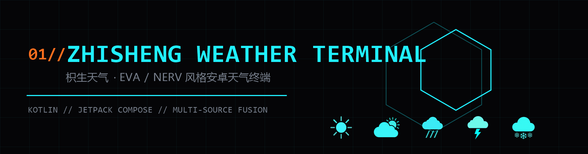
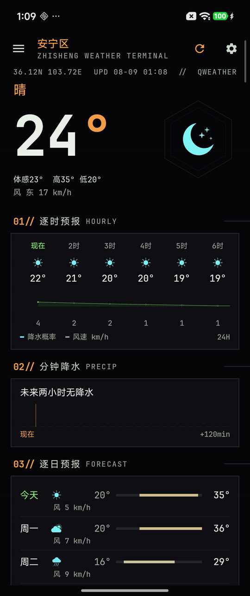
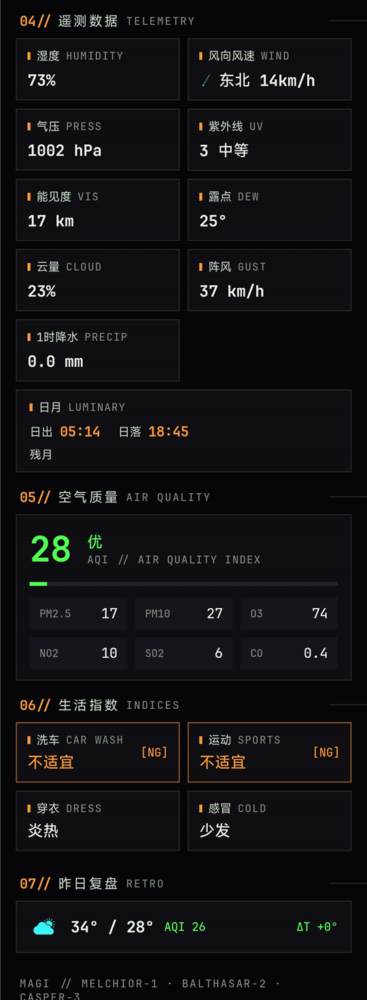
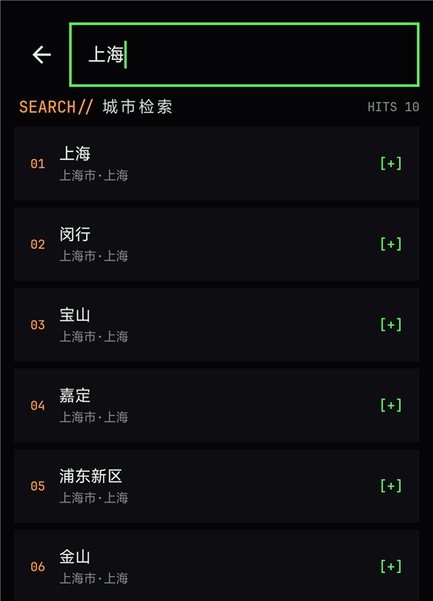
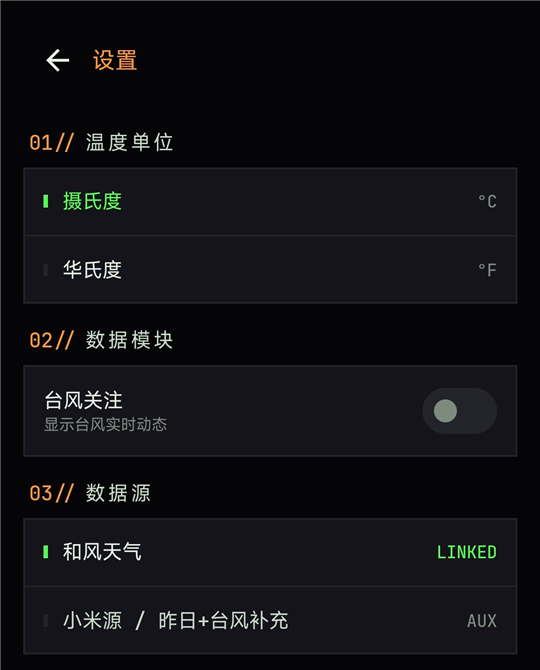
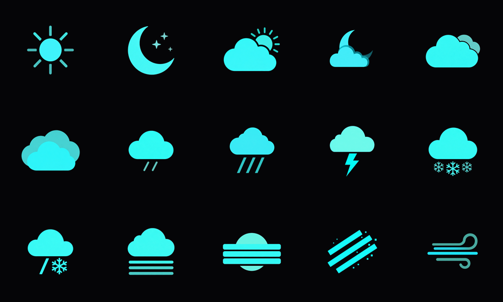

<p align="center">
  <b>枳生天气</b> // ZHISHENG WEATHER TERMINAL<br/>
  一部 EVA 磷光终端美学的安卓天气终端。<br/>
  <sub>MAGI // MELCHIOR-1 · BALTHASAR-2 · CASPER-3</sub>
</p>

---

## ⬇ 立即获取 GET IT NOW

| 方式 | 适合 | 说明 |
|:--|:--|:--|
| [**直接下 APK**](../../releases) | 只想用的用户 | Releases 的 `public` 公开版，零配置，装上即用 |
| **源码构建** | 开发者 / 满血版用户 | 见 `06//`；填自己的和风凭据解锁主源 |

> 公开版 APK 以 `-PpublicBuild` 构建：**不含任何和风凭据**，数据走小米源 + Open-Meteo 公共源；
> 满血版（和风主源：分钟级降水图 / 穿衣感冒指数等）需源码构建并自备凭据。

<p align="center">
  
  
  
  
</p>

**枳生天气**是一款风格相当"个人向"的安卓天气应用：黑底单色青的磷光终端界面，信息密度拉满。没有广告，没有会员套路，不会动不动就要求你授权一堆东西。打开就是天气，别的都省了。

市面上的天气应用越做越重——开屏广告、会员弹窗、通知里夹带营销推送。我想要的只是一个打开就能看、没有多余东西的工具，找了一圈没有完全合意的，干脆自己写了一个。

---

## 01// 界面预览 SCREENSHOTS

| 主页 // HOME | 遥测 // TELEMETRY | 搜索 // SEARCH | 设置 // SETTINGS |
|:---:|:---:|:---:|:---:|
|  |  |  |  |
| 实时天气 · 灾害预警 · 逐时降水 | 湿度 / 风向 / 气压等遥测 · 空气质量 · 生活指数 | 城市检索 · 多城管理 | 单位 · 模块开关 · 数据源状态 |

## 02// 功能特性 FEATURES

- **实时天气**：温度、体感、天气现象，六边形图标一眼看懂
- **灾害预警**：气象预警按黄 / 橙 / 红分级着色，斜纹警示条，点开看详情
- **逐时预报**：未来 24 小时温度曲线 + 降水概率
- **分钟级降水**：未来两小时逐分钟降水柱状图，出门前扫一眼要不要带伞
- **15 天趋势**：逐日高低温、归一化温度条、冷暖自动配色，哪天降温一目了然
- **空气质量**：AQI 主值 + PM2.5 / PM10 / O₃ / NO₂ / SO₂ / CO 六项分测
- **生活指数**：洗车 / 运动 / 穿衣 / 感冒，不适合的那项标橙，别硬冲
- **昨日复盘**：昨天高低温、AQI、温差，今天体感热不热心里有数
- **日月与月相**：日出日落 + 月相，本地天文算法直接算，不额外发请求
- **台风路径**：台风动向追踪（辅助源，淡季或无数据时为空白）
- **多城市**：搜索、收藏、一键切换；同名城市标注省份归属（甘肃·金昌 / 四川·阿坝），不会选错
- **单位与模块**：℃ / ℉ 全局切换，数据模块可单独开关

## 03// 图标系统 ICON SYSTEM

<p align="center"></p>

全套 **15 枚**终端风天气图标：纯黑底 · 单色青双色调 · 锐利矢量边缘。每枚由阿里云百炼 `qwen-image` 系列模型文生图生成，再走本地图像处理管线加工入库：

```
AI 生成 1024² ──▶ 亮度→Alpha 键控（黑底转透明）──▶ 32bpp 边缘平滑 ──▶ 512px 归一 ──▶ drawable-nodpi
```

覆盖：晴 / 多云 / 阴 / 雾 / 小雨 / 大雨 / 雷暴 / 雪 / 风 / 霰 等，昼夜变体（日 / 月）齐备。

## 04// 数据融合 DATA SOURCES

和市面上很多天气应用不同，枳生天气不是只吃一家数据，而是把三个来源拼起来。任何一路出问题，界面都不会"开天窗"：

| 链路角色 | 数据源 | 负责 |
|:--|:--|:--|
| **主源** | 和风天气 | 实时 / 预警 / 逐时 / 逐日 / 分钟降水 / 空气质量 / 生活指数 |
| **补充** | 小米天气 | 昨日复盘 / 台风 / 逐日后半段 / 预警合并 |
| **兜底** | Open-Meteo | 全球免费源，逐时 / 逐日不足时自动补齐 |

具体来说：主源逐时数据少于两条时，按城市本地时区折算时间轴，用 Open-Meteo 补满 24 小时；逐日不满 15 天时同样补尾。海外城市也凑得满 15 天。

认证上，和风接口用 Ed25519（EdDSA）签名 JWT，密钥只放在本地 `local.properties`，仓库里不随附任何凭据。

## 05// 技术栈 STACK

| 层 | 选型 |
|:--|:--|
| 语言 / 构建 | Kotlin 2.0.21 · AGP 8.5.2 · JDK 17（minSdk 26 / targetSdk 34） |
| UI | Jetpack Compose + Material 3，整套磷光终端主题 |
| 架构 | MVVM，`ViewModel` + `StateFlow`，Repository 做三源融合 |
| 网络 | Retrofit 2.11 + OkHttp 4.12（kotlinx-serialization） |
| 安全 | BouncyCastle，Ed25519 JWT 运行时签名 |
| 存储 | DataStore（城市 / 偏好 / 模块开关） |
| 并发 | kotlinx-coroutines 1.9 |

## 06// 项目结构 STRUCTURE

```
app/src/main/kotlin/com/zhisheng/weather/
├── MainActivity.kt              # 单 Activity 入口
├── data/
│   ├── QWeatherApi.kt / QwAuth.kt / QwModels.kt   # 主源 + Ed25519 JWT 签名
│   ├── XiaomiApi.kt / XiaomiModels.kt             # 补充链
│   ├── OpenMeteoApi.kt                            # 兜底链（daily + hourly）
│   ├── WeatherRepository.kt                       # 三源融合 · backfill 决策
│   ├── MoonCalc.kt                                # 本地月相算法（Meeus）
│   └── CityRepository.kt / SettingsRepository.kt  # 城市 / 偏好
├── model/Weather.kt             # 领域模型
└── ui/
    ├── WeatherViewModel.kt
    ├── home/HomeScreen.kt       # 主页终端面板
    ├── SearchScreen.kt / SettingsScreen.kt
    └── components/WeatherIcon.kt # 图标渲染
```

## 07// 构建与运行 BUILD

需要 JDK 17 和 Android SDK 34，Gradle Wrapper 自带。

1. clone 仓库：

```bash
git clone https://github.com/ZhishengZZ/ZhishengWeather.git
```

2. 在工程根目录建 `local.properties`（不入库），填和风天气凭据：

```properties
sdk.dir=<你的 Android SDK 路径>
qw.host=<你的 API Host，如 xxx.qweatherapi.com>
qw.project_id=<Project ID>
qw.kid=<Key ID>
qw.private_key=<Ed25519 私钥，单行>
# 可选：覆盖 release 签名口令
keystore.store_password=<...>
keystore.key_password=<...>
```

3. 构建：

```bash
./gradlew assembleDebug      # 调试包
./gradlew assembleRelease    # 签名发布包（个人满血版，需自备 keystore/zhisheng.jks）
./gradlew assembleRelease -PpublicBuild   # 公开版：凭据强制为空 + 随库公开证书，用于 Release 分发
```

> **不填凭据也能跑**：主源自动停用，退化为小米源 + Open-Meteo，实况 / 逐时 / 逐日 / 空气质量 / 预警都还在。首次安装默认给你北京，装好就能看。
>
> release 签名默认读 `keystore/zhisheng.jks`（alias `zhisheng`）。出于安全，keystore 和凭据都不随仓库分发；只装调试包的话直接 `assembleDebug` 即可。

## 08// 已知不足 KNOWN ISSUES

真实的项目总有不完美，先写在这：

- 台风模块用的是辅助数据源，可能为空（和风台风接口没有免费额度）
- 海外城市分钟级降水不可用（免费档接口限制），这个区块会是空的
- 预警跨源去重按标题精确匹配，不同源文案略有出入时可能重复
- 界面图标是单色 stroke 风，多色版看后续有没有动力做

## 09// 版本记录 CHANGELOG

**v1.2.5**（当前）

- 零配置体验：首装种子默认城市北京，装好即有天气（无凭据自动降级小米源 + Open-Meteo）
- 新增 `-PpublicBuild` 公开版构建链路：凭据强制为空 + 随库公开证书 `keystore/public.jks`
- Release 发布公开版 APK，零配置安装即用

**v1.2.4**

- 同名城市串台修复：小米按名反查改为取最近距离命中，超 150km 视为无匹配；城市抽屉显示省份归属
- 全新图标系统：15 枚单色青双色调终端风图标，替换旧矢量图
- 逐时预报引入 Open-Meteo 兜底，修复部分城市逐时缺失
- 一批健壮性修复：单位换算改读接口 unit 字段、搜索竞态、JWT 并发取 token、失败重试

**v1.2.3**

- 15 天逐日补齐：Open-Meteo 全球兜底，东京这类海外城市也凑满
- 月相本地计算兜底（Meeus 天文算法），不再依赖某个源是否给字段
- 切城市立即取消旧请求，不再串数据

更早的改动见 commit 历史。

## 10// 许可与声明 LICENSE & NOTES

- 基于 [MIT](LICENSE) 开源；社区规范见 [贡献指南](CONTRIBUTING.md) · [行为准则](CODE_OF_CONDUCT.md) · [安全说明](SECURITY.md)
- 个人学习与兴趣作品，UI 美学致敬 EVA / NERV 终端风格，仅作同人创作，不用于商业
- 天气数据版权归属：[和风天气](https://www.qweather.com/) · [Open-Meteo](https://open-meteo.com/) · 小米天气；数据仅供参考
- 使用和风天气需自行申请开发者凭据与 Ed25519 密钥，详见其官方文档
- 代码中不含任何随附凭据；请勿把你的 Key / 私钥提交到公开仓库

---

<p align="center"><sub>ZHISHENG WEATHER TERMINAL // PATTERN BLUE · made with phosphor & kotlin</sub></p>
